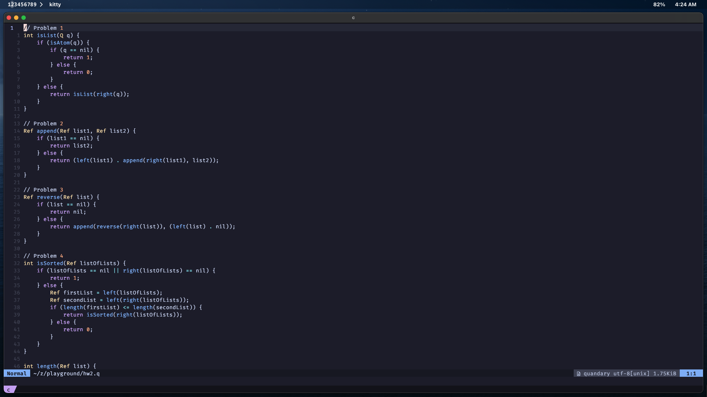
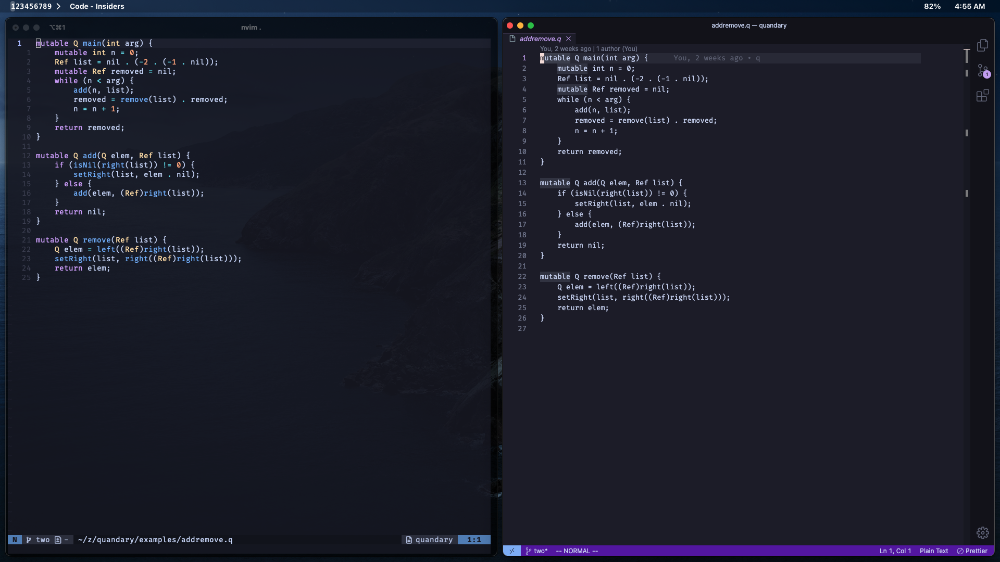

# Quandary Language Support for Neovim

A Neovim plugin that provides language support for [Quandary](https://github.com/mdbond/Quandary-Public), including syntax highlighting.

## Features

- Syntax highlighting for Quandary files (`.q` and `.qet` extensions)
- Automatic filetype detection
- Basic language configuration (comments, formatting)

## Installation

### Using [LazyNvim](https://github.com/folke/lazy.nvim):

```lua
{
  "yoleuh/quandary-nvim",
  ft = {"quandary"},
  config = true,
}
```

### Using [packer.nvim](https://github.com/wbthomason/packer.nvim)

```lua
use 'yoleuh/quandary-nvim'
```

### Using [vim-plug](https://github.com/junegunn/vim-plug)

```vim
Plug 'yoleuh/quandary-nvim'
```
## Configuration

Add the following to your `init.lua`:

```lua
require('quandary')
```

### Usage

Once installed, quandary-nvim will automatically activate for any `.q` or `.qet` files. You'll immediately benefit from:

- Syntax highlighting
- Proper comment formatting (use `gc` in normal mode to toggle comments)
- Smart indentation

## Screenshots
Quandary Syntax Highlighting\

Quandary Syntax Highlighting in Neovim vs Plain Text in VSCode \


